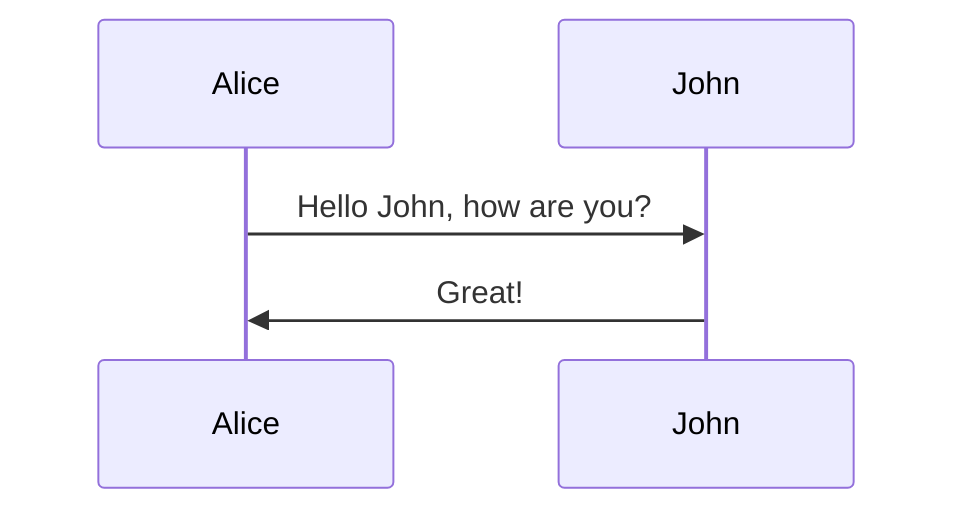

# Pins Add-on Library for MapTools

The purpose of this library is supply a Pins function, like 
that found in the DnD 5ed framework by Rod Takehara. 

This library is written from the ground up using html5, css3 and javascript
whereever it is possible. 

MTScript is used for glueing everything together for MapTool. 

## Requirements

1. Easy creation and configuration of pin tokens. 
2. Easy layer placement of pins.
3. A pin should employ both Notes and GM Notes of the token.
4. 


```
+---------------------------------------------+
| Pin Setup Dialog                            |
+---------------------------------------------+
|                                             |
| Name       ________________________________ | 
| Image      _____________________________|v| |
| 

```


